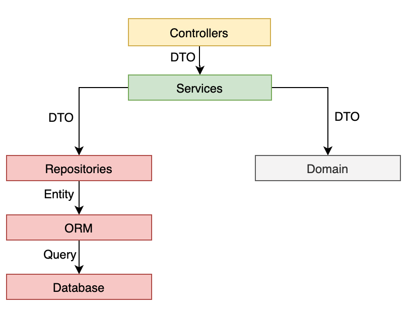

# Domain Driven Design with NodeJS, TypeScript and MongoDB

### How to install

    npm install
    
### Environment variables

    echo PORT=8080 >> .env.local
    echo DATABASE_URI=test >> .env.local
    echo JWT_SECRET=test >> .env.local
    echo JWT_EXPIRE_IN=60 >> .env.local

### How to run

    npm start
    
### How to create build

    npm run build
    
### How to run production server

    npm run server
    
### Swagger OpenAPI documentation

    http://localhost:8080/api-doc/

## Documentation

#### .domains - Domain Layer, all business implementation

#### .services - Service Layer, in this case we can call this also Application Layer

#### .repositories - Data Access Layer, contains all database model's use mongoose ORM

#### .dto - data transfer object,  

#### api - Presentation Layer, swagger, controllers, routes 

#### auth - Authentication

#### errors - Error classes for services

#### helpers - Static helper actions

#### tests - Tests

#### utils - common tools for all layers